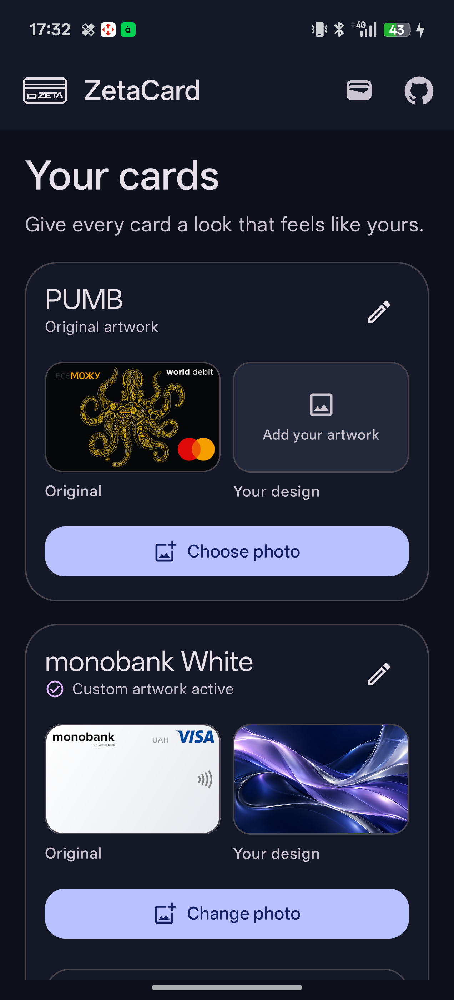
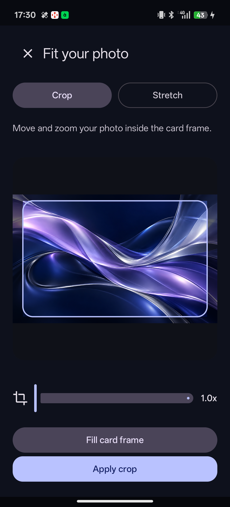

# ZetaCard

ZetaCard is an original Android LSPosed module for giving Google Wallet payment cards custom artwork. Its English-only Material 3 manager shows the original card artwork beside your design. You can pick a photo, crop it to card proportions or stretch it to fit, rename the local card entry, or restore the original appearance.

The module changes artwork in the Wallet user interface. It does not edit payment credentials, NFC services, or Google Play Services.

## Screenshots

| Your cards | Crop editor | In Google Wallet |
|:---:|:---:|:---:|
|  |  |  |

## Requirements

- Android 10 or newer
- Google Wallet
- LSPosed / Vector with Modern API 102

## Build

Use JDK 17 or newer and Android SDK 37. The included Gradle wrapper downloads Gradle 9.7.1:

```sh
./gradlew assembleDebug
```

The APK is created at `app/build/outputs/apk/debug/app-debug.apk`.

GitHub Actions builds a debug APK on every push and publishes it as a preview in [Releases](https://github.com/hxfuxyy/ZetaCard/releases). To publish a versioned release, select **Actions → Build APK → Run workflow** and enter a version name and a higher Android version code. Push builds use version 1.3 and code 130; change the workflow defaults to change those values. GitHub Actions APKs are debug-signed on its runner, so APKs from separate runs may require uninstalling the previous build before installation. A stable signing key is needed for seamless upgrades between runs.

## Setup

1. Install the APK.
2. Enable ZetaCard in LSPosed or Vector with `com.google.android.apps.walletnfcrel` in scope.
3. Open ZetaCard once to grant Wallet access to its artwork, then force stop and reopen Google Wallet. ZetaCard discovers your payment cards and saves local previews of their original artwork.
4. Return to ZetaCard, choose and crop an image for a discovered card, then reopen Wallet.

Original previews are saved in ZetaCard's private app storage. Custom artwork is also copied to LSPosed's private module storage so it remains available when the ZetaCard interface is closed. Restoring a card removes both copies. The module derives a local SHA-256 ID from the card artwork URL. The URL is never saved by ZetaCard. The selected art remains visible with Wallet's masked card digits over it.

ZetaCard saves the discovered hook map for each Wallet version. **Detect hooks** requests a fresh scan and reloads the module in a running Wallet process. **View logs** shows app events for the current app session, including when ZetaCard is in the background. The session log clears when the app is fully closed and reopened. **Export** saves a text report with app events, device and firmware details, and app versions. Wallet hook events are available in LSPosed logs.

## Compatibility

Verified on OnePlus Ace 6T, Android 16, Vector 1.2, and Google Wallet `26.39.993999421`, including its Compose card screen. Wallet is obfuscated and changes often. If its card renderer changes again, the module leaves Wallet's original artwork visible until ZetaCard is updated. NFC payments were not exercised as part of visual testing.

## Source and permissions

Copyright (c) 2026 hxfuxyy. All rights reserved. The [ZetaCard Source License](LICENSE) allows viewing and forking on GitHub and personal use of official APKs. It does not grant permission to reuse, modify, build, or redistribute the original source code. Third-party dependencies keep their own licenses.

GitHub: https://github.com/hxfuxyy/ZetaCard
